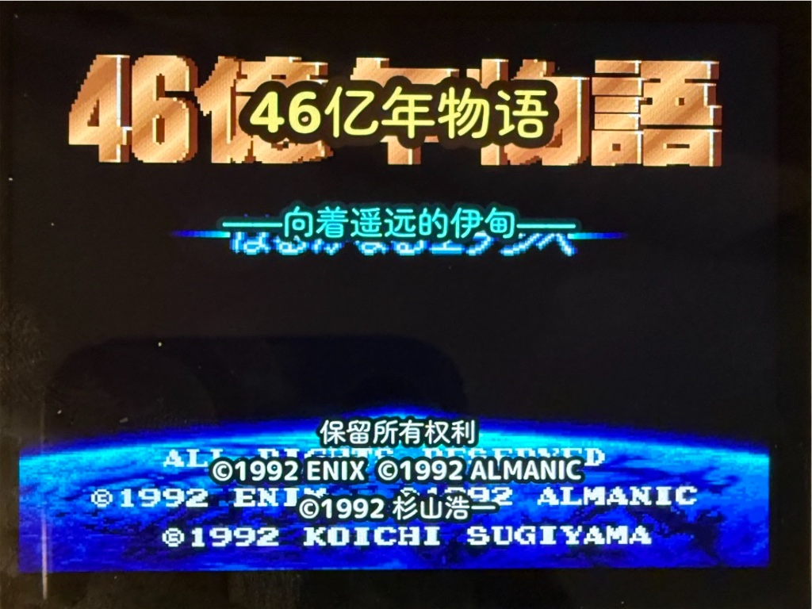
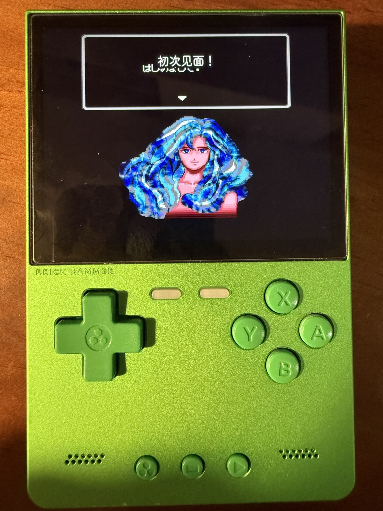
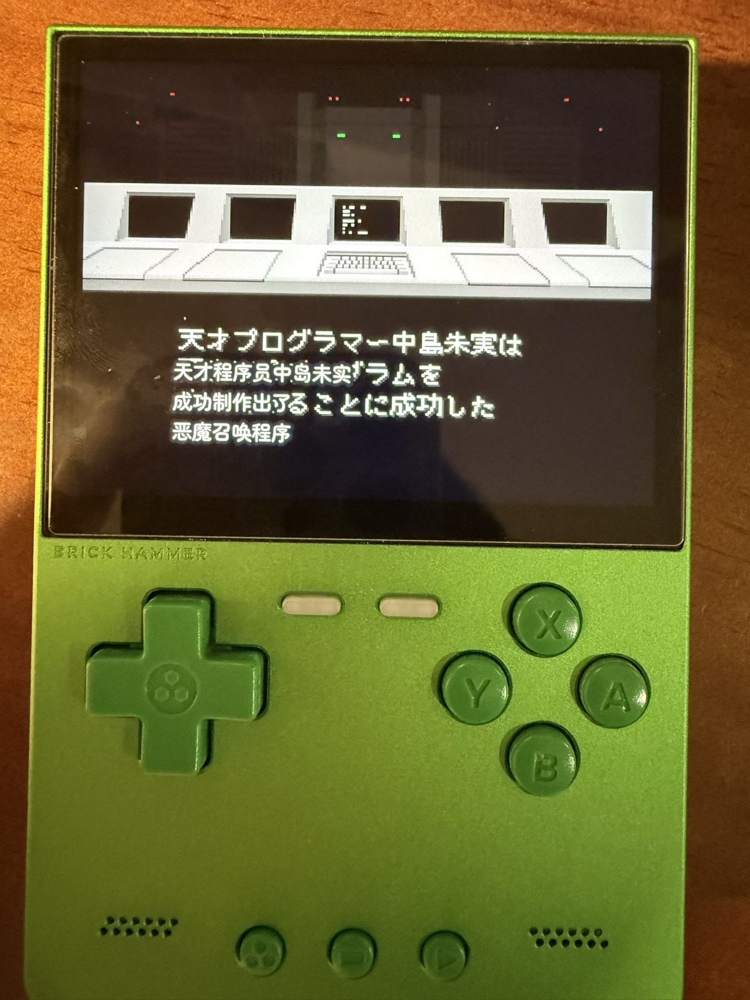
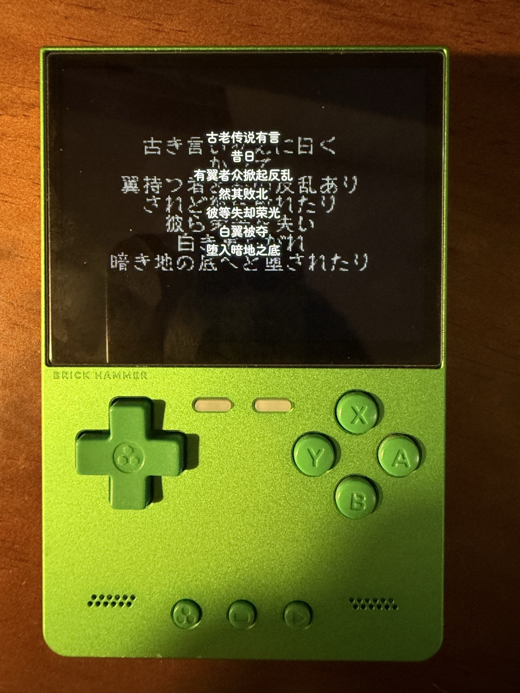
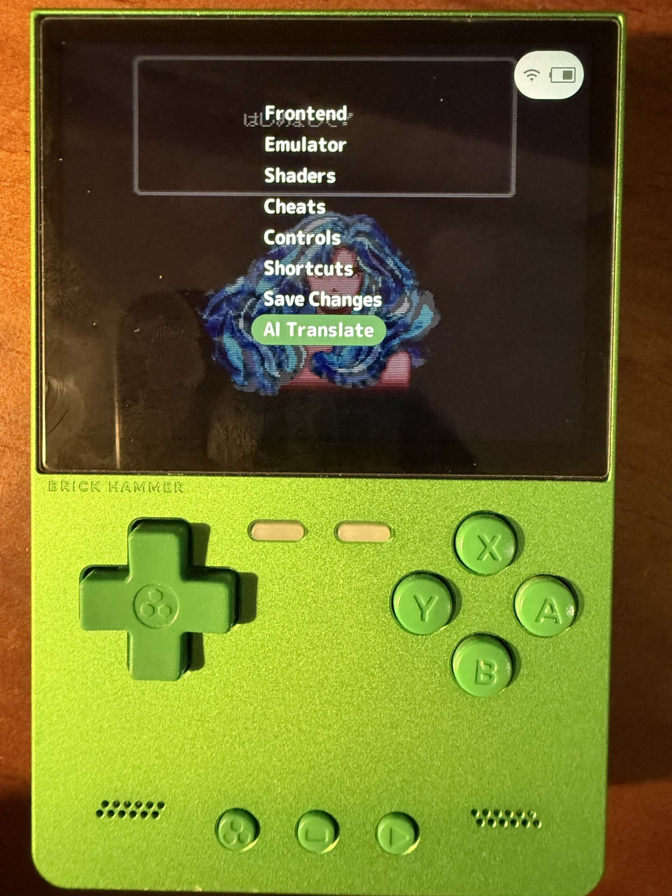
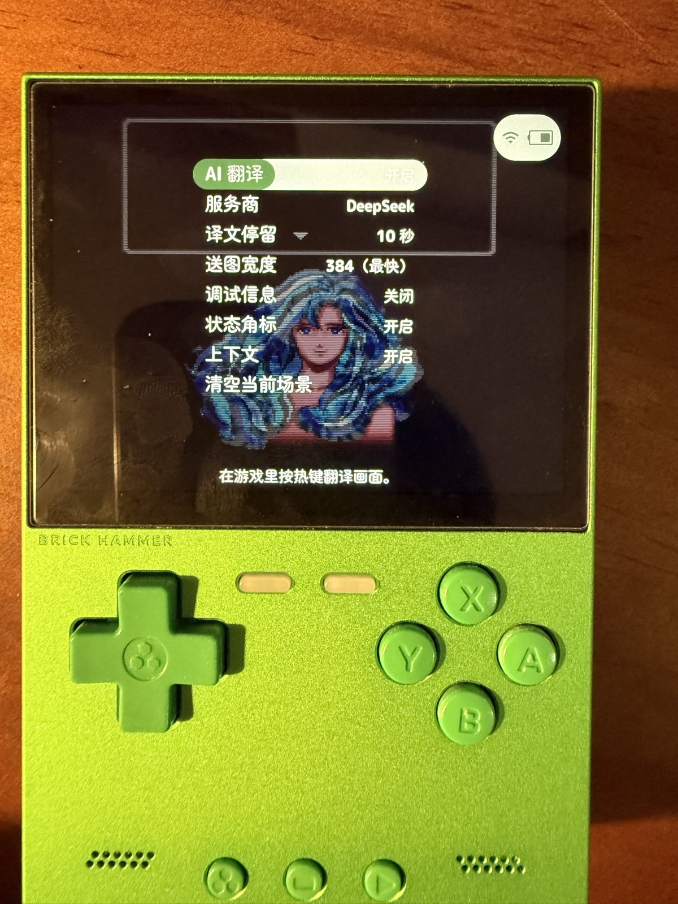
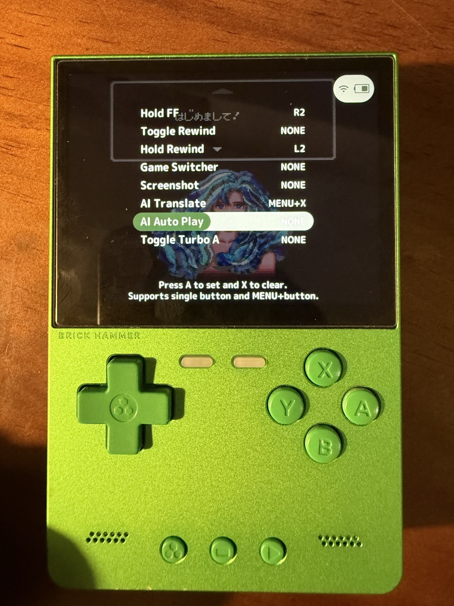

# next-ui-AItranslate

按 **MENU+X**，把游戏画面上的文字翻译成中文。

**仅适用于运行 NextUI 的 TrimUI Brick。** 当前编译版对应 NextUI v6.14.0（20260719），平台目录为 `tg5040`。

### 1. 下载并复制

前往 **[Releases 下载编译好的文件](https://github.com/Drafffffff/next-ui-AItranslate/releases/latest)**，下载 `minarch.elf`。

关机后取出 SD 卡，先备份原文件，再把下载的文件复制到 SD 卡的以下位置并覆盖：

```text
.system/tg5040/bin/minarch.elf
```

如果看不到 `.system` 文件夹，请开启“显示隐藏文件”。

### 2. 填入 API Key

前往 **[DeepSeek 平台获取 API Key](https://platform.deepseek.com/api_keys)**，登录后创建并复制 Key。

在 SD 卡上创建或编辑 `.userdata/shared/ai-keys.txt`，填入 Key：

```ini
DEEPSEEK_API_KEY=填入你的DeepSeekAPIKey
DASHSCOPE_API_KEY=
```

这是掌机 AI 应用共用的配置；百炼 Key 填在 `DASHSCOPE_API_KEY`，两项可同时保留。

再在 `.userdata/shared/ai-translate.txt` 启用翻译（默认使用 DeepSeek）：

```ini
aiEnable=1
aiProvider=1
```

### 3. 开始翻译

安全弹出 SD 卡，插回掌机并开机。连接 Wi-Fi，进入游戏，**按住 MENU，再按 X** 即可翻译。

### 中文字体

如果中文显示不全或出现方框，下载 **[我们合并的中文字体 font1.ttf](https://github.com/Drafffffff/next-ui-AItranslate/raw/refs/heads/main/fonts/font1.ttf)**，备份后覆盖 SD 卡上的 `.system/res/font1.ttf`，重启生效。保留原版英文字形，汉字使用圆体。

### Brick Mic 语音输入

在同一 [Release](https://github.com/Drafffffff/next-ui-AItranslate/releases/latest) 下载 `Brick-Mic-TrimUI-Brick.zip`，解压后把 `Brick Mic.pak` 复制到 SD 卡 `Tools/tg5040/`。电脑端选择 Mac 安装包或 Linux 接收端；用百炼 Key 配置语音识别。

首次连接：打开掌机 **工具 → Brick Mic**，同时按 **L1+R1**，选择「查找电脑」，再选中自己的电脑。**按住 A 说话，松开出字**；以后记住上次选择的电脑。

[Mac 安装和按键说明](ports/brick-mic/README.md) · [Bazzite / Linux 安装](docs/BRICK-MIC-LINUX.md)

### 真机展示

点击图片可查看大图。

<table>
  <tr>
    <td width="50%" align="center"><a href="docs/images/brick-7856.jpg"></a><br><sub>标题翻译</sub></td>
    <td width="50%" align="center"><a href="docs/images/brick-7857.jpg"></a><br><sub>人物对话</sub></td>
  </tr>
  <tr>
    <td width="50%" align="center"><a href="docs/images/brick-7855.jpg"></a><br><sub>剧情文本</sub></td>
    <td width="50%" align="center"><a href="docs/images/brick-7853.jpg"></a><br><sub>叙事阅读效果</sub></td>
  </tr>
</table>

**菜单与设置**

<table>
  <tr>
    <td width="33%" align="center"><a href="docs/images/brick-7858.jpg"></a><br><sub>菜单入口</sub></td>
    <td width="33%" align="center"><a href="docs/images/brick-7859.jpg"></a><br><sub>翻译设置</sub></td>
    <td width="33%" align="center"><a href="docs/images/brick-7860.jpg"></a><br><sub>MENU+X 快捷键</sub></td>
  </tr>
</table>

---

需要从源码构建？查看 **[完整编译教程](docs/BUILD.md)**。

基于 [NextUI](https://github.com/LoveRetro/NextUI)。[详细说明](README-AI翻译.md) · [许可证](LICENSE)
